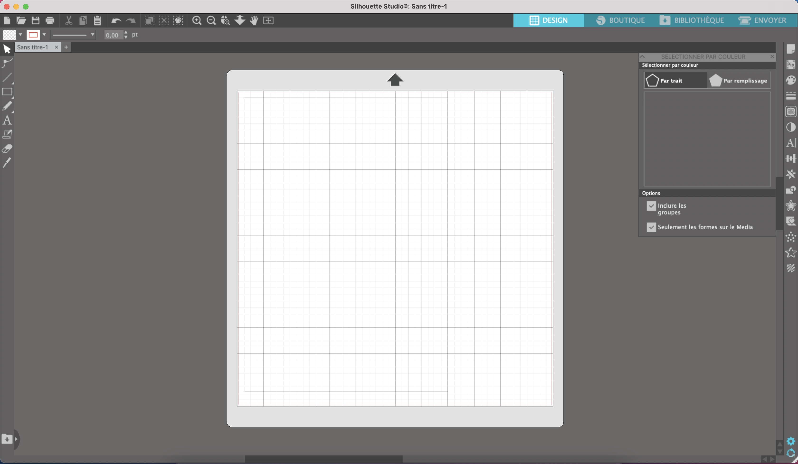
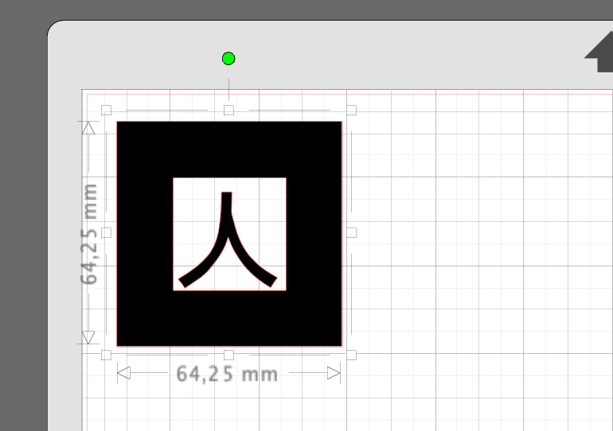
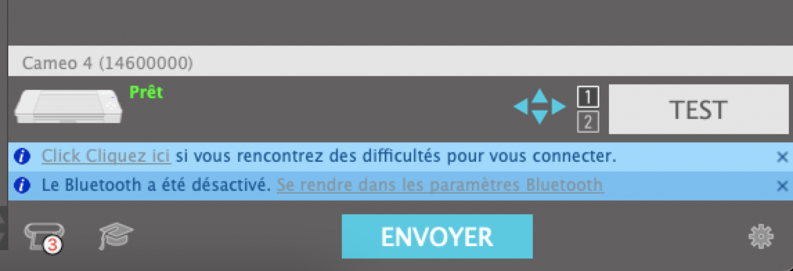
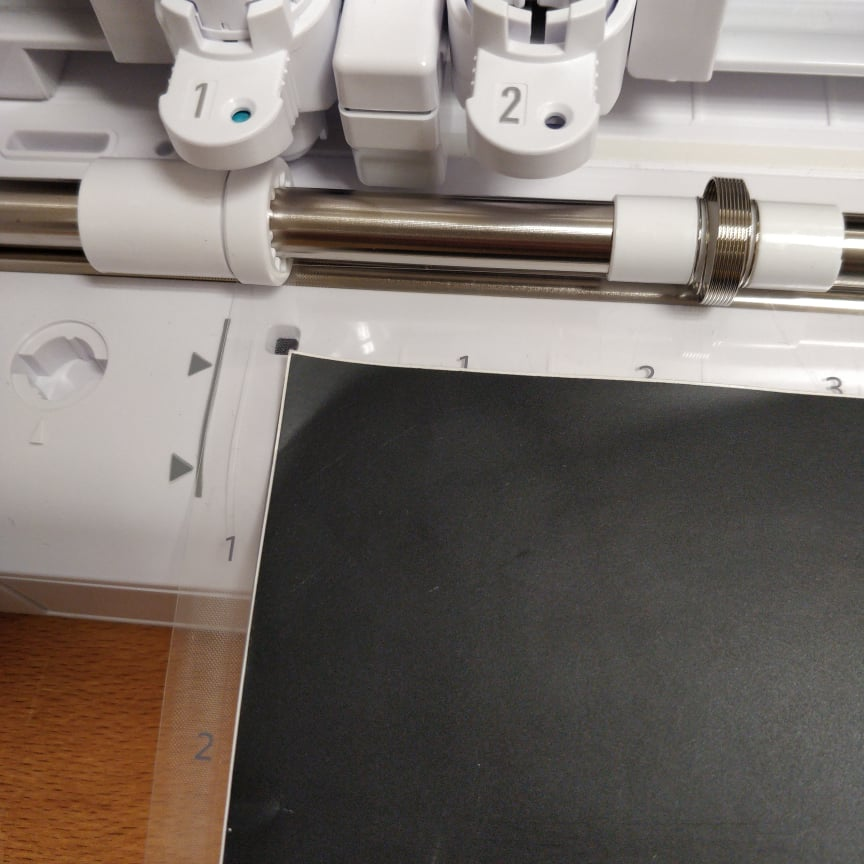

# Silhouette Cameo 2spi

**Ou comment utiliser plus ou moins en autonomie la Silhouette Cameo pour découper du vinyle, papier, et ainsi de suite.**

<!--gif-->

## Mise en place

Commencer par installer le [logiciel Silhouette Studio](https://www.silhouettefr.fr/applications-logiciels/), et faire glisser le png à imprimer sur la surface de découpe.

Il faut utiliser un png à fond transparent, permettant la découpe entre la partie pleine et la partie vide.
Il faut donc vérifier que les traits rouges sur le png représentant les traits à découper sont bien placés et complets, vérifier la taille, et laisser un petit écart avec le bord.

Une fois que tous les motifs à découper sont placés sur la surface dans le logiciel, on peux brancher, ouvrir et allumer la Cameo.

## Envoi du motif à découper

Passer du mode Design au mode Envoyer en haut à droite dans le logiciel, puis brancher la Cameo en USB. 

Vérifier qu'elle est disponible en bas à droite dans le mode Envoyer.

Récupérer la plaque en plastique de découpe et enlever le papier bleu de la zone collante, et coller du vinyle bien à plat dessus. Vérifier que toute la zone est couverte, ou du moins la zone sur laquelle on a des motifs à découper.

Caler la plaque de découpe dans le coin sur la Cameo, et appuyer sur le bouton flèche vers le haut 🔼 pour engager la plaque.

Dans le mode Envoyer, sélectionner le type de matériau à découper puis cliquer sur le bouton Envoyer.

**Point matériau :**
- Vinyle, Mat = les vinyles de base, en rouleau ou en plaque, pas besoin de modifier les valeurs de découpe
- Feuille d'autocollant métallique brossé = plaques de cuivre, pour ne pas découper le support carton de la plaque de cuivre, c'est mieux de baisser la force de la lame à 18.

## Récuperer le sticker

Une fois la découpe finie, après que la lame soit retournée se placer tout à gauche de la Cameo, appuyer sur le bouton flèche vers le bas 🔽 pour libérer la plaque de découpe.

Décoller doucement la plaque de vinyle de la plaque en plastique, et remettre soigneusement le papier bleu sur la plaque.
Découper au ciseau autour du motif découpé, et enlever tout le vinyle de contreforme. 

<!--gif d'enlever la contreforme-->

Si besoin, mettre du scotch de peintre ou de l'autocollant de transfert par dessus le motif découpé pour le caler avant de le coller. Enlever le support de vinyle en dessous, le coller, frotter pour enlever les bulles d'air puis enlever le scotch par dessus.
# SilhouetteCameo_sp33d
